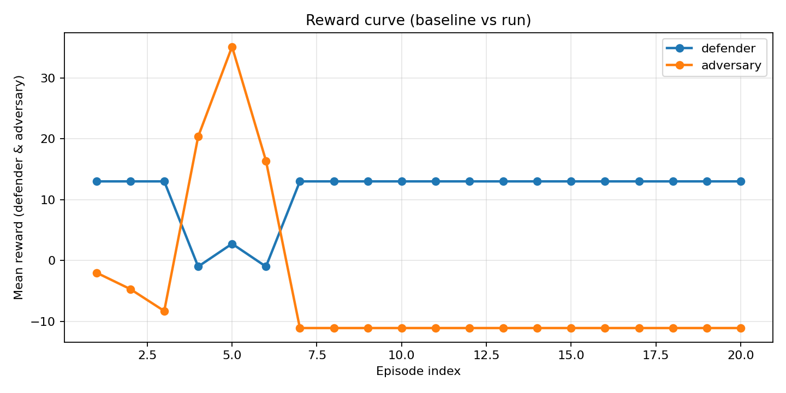
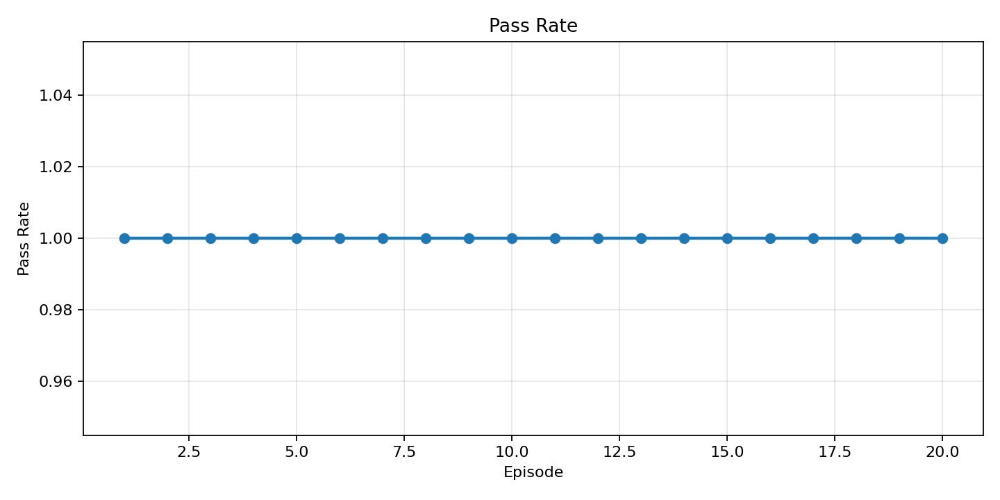
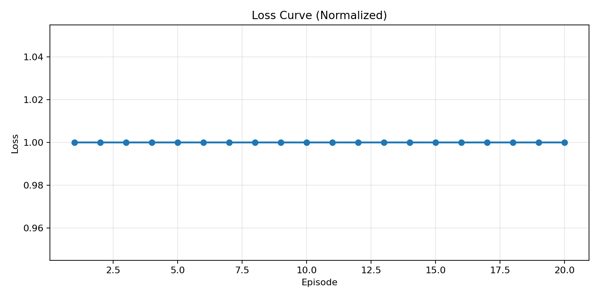

# FORGE-v4 — Adversarial self-improvement for robust code generation

[](https://huggingface.co/spaces/sanjay7676/Team404_FORGE)
[](https://github.com/Sanjay767676/Meta-x-Scaler-Team404--Round2)
[](https://colab.research.google.com/drive/1mKXjIX-eB2GSiebI-_n37KzVlN1NKCu8?usp=sharing)
[](https://colab.research.google.com/github/Sanjay767676/Meta-x-Scaler-Team404--Round2/blob/main/FORGE_Training_Colab.ipynb)
[](https://huggingface.co/sanjay7676/forge-qwen-final)
[](https://hub.docker.com/r/sanjay767676/forge)
[](https://docs.google.com/document/d/1Odznuzwtb1ecDOm2t6ToZd4MuMXXfO6vWUGcxbC6mFs/edit?tab=t.0#bookmark=kix.2dz0x0nie3me)

### Judge quick links (all materials)

| Resource | URL |
| :-- | :-- |
| **What judges look for (official rubric doc)** | [Google Doc — judging criteria](https://docs.google.com/document/d/1Odznuzwtb1ecDOm2t6ToZd4MuMXXfO6vWUGcxbC6mFs/edit?tab=t.0#bookmark=kix.2dz0x0nie3me) |
| **OpenEnv + TRL (framework docs)** | [Hugging Face TRL — OpenEnv integration](https://huggingface.co/docs/trl/openenv) |
| **Hugging Face Space (submit this URL)** | [huggingface.co/spaces/sanjay7676/Team404_FORGE](https://huggingface.co/spaces/sanjay7676/Team404_FORGE) |
| **Source code** | [github.com/Sanjay767676/Meta-x-Scaler-Team404--Round2](https://github.com/Sanjay767676/Meta-x-Scaler-Team404--Round2) |
| **Blog (writeup)** | [BLOG.md](BLOG.md) in repo |
| **Training Colab (author Drive)** | [Colab notebook](https://colab.research.google.com/drive/1mKXjIX-eB2GSiebI-_n37KzVlN1NKCu8?usp=sharing) |
| **Colab model + adapter training** | https://colab.research.google.com/drive/1mKXjIX-eB2GSiebI-_n37KzVlN1NKCu8?usp=sharing |
| **Training Colab (synced from GitHub)** | [FORGE_Training_Colab.ipynb on Colab](https://colab.research.google.com/github/Sanjay767676/Meta-x-Scaler-Team404--Round2/blob/main/FORGE_Training_Colab.ipynb) |
| **Trained adapter** | [sanjay7676/forge-qwen-final](https://huggingface.co/sanjay7676/forge-qwen-final) |
| **Docker image (public — anyone can pull)** | **Hub (tags, README):** [hub.docker.com/r/sanjay767676/forge](https://hub.docker.com/r/sanjay767676/forge) — **pull:** `docker pull sanjay767676/forge:latest` — **registry ref:** `docker.io/sanjay767676/forge:latest` |
| **Command / security cheat sheet** | [guide.md](guide.md) |
| **Video / slides** | YouTube demo placeholder: https://youtube.com/watch?v=YOUR_DEMO_VIDEO_ID |

### Hugging Face Space (CPU-only)

- This repo’s **Space README** sets **`suggested_hardware: cpu-basic`** (see [Spaces config](https://huggingface.co/docs/hub/spaces-config-reference)). **Pick CPU hardware in the Space Settings UI** if you are not on GPU.
- **`requirements.txt`** is intentionally **light** (no PyTorch / bitsandbytes) so CPU Spaces **build and start** reliably.
- For a stable demo on CPU, set Space secret **`CODE_PROVIDER_MODE=mock`** (or use **NIM** / **OpenRouter** keys so the router never loads local `custom_hf`). Loading **`Qwen2.5-Coder-1.5B` + LoRA** on free CPU is likely to **OOM or time out**.
- Full training stack: install **[`requirements-train.txt`](requirements-train.txt)** on **Colab** or locally (see Quickstart).

### OpenEnv HTTP API on the Hugging Face Space

The Space runs the same FastAPI routes as [`api_server.py`](api_server.py) on the **app root**, with **Gradio at `/`** (same host as `/health`, `/reset`, `/step`, `/state`). There is **no `/start`** endpoint — begin an episode with **`POST /reset`**, then drive it with **`POST /step`**.

1. **Base URL:** open the live Space, then use the **`*.hf.space`** host shown in the address bar (for this project it is typically **`https://sanjay7676-team404-forge.hf.space`**). If yours differs, copy it from the running app or from the Space **Embed** snippet.
2. **Check liveness:** `curl -sS "https://sanjay7676-team404-forge.hf.space/health"`
3. **New episode:** `curl -sS -X POST "https://sanjay7676-team404-forge.hf.space/reset" -H "Content-Type: application/json"`
4. **Step** (JSON body must include `coder_code` and `coder_version`; omit `candidate_solutions` or send a JSON array of strings):

```bash
curl -sS -X POST "https://sanjay7676-team404-forge.hf.space/step" \
  -H "Content-Type: application/json" \
  -d "{\"coder_code\": \"def solution(arr):\\n    return sorted(list(arr))\", \"coder_version\": \"demo\"}"
```

5. **Observe state:** `curl -sS "https://sanjay7676-team404-forge.hf.space/state"`

**Windows `curl` + `@step.json`:** `curl` resolves the file **relative to your current directory**. Either `cd` into the folder that contains `step.json`, or pass a full path, for example:

`curl.exe ... --data-binary "@examples/space_step.json"` (from repo root) or any **absolute** path to your JSON file.

**If the Hub “App” tab is blank:** the Space sits behind a TLS proxy. Gradio was issuing a **`307` redirect to `http://…`** (see `curl -I` on `/`), which **HTTPS pages block as mixed content** inside the Hub iframe → empty canvas. **`app.py` adds `ProxyHeadersMiddleware`** so redirects use **`https://`** after you rebuild the Space. Then open **`https://sanjay7676-team404-forge.hf.space/`** (or wait for the Hub App tab). If the Hub tab is still empty, allow third-party cookies ([HF discussion](https://discuss.huggingface.co/t/cant-able-to-see-ui-when-the-model-is-running/56373)).

**Note:** The Space shares **one** in-memory environment across all visitors — concurrent `reset` / `step` calls can interleave. For isolated runs, use **Docker** or **local** `api_server.py` on port `8000`.

### NOTE 1 — Non‑negotiable submission requirements (checklist)

| # | Requirement | FORGE-v4 |
| :--: | :-- | :-- |
| 1 | **OpenEnv (latest):** build on the framework | **`openenv-core>=0.2.3`** in [`requirements.txt`](requirements.txt). Training extras in [`requirements-train.txt`](requirements-train.txt). Wrapper: [`env_openenv.py`](env_openenv.py). Core: [`env.py`](env.py). |
| 2 | **Training:** Unsloth or TRL (or other RL stack) + **Colab** | [`train_unsloth.py`](train_unsloth.py) (Unsloth + TRL), [`train_colab.py`](train_colab.py), [`FORGE_Training_Colab.ipynb`](FORGE_Training_Colab.ipynb), Colab links in the table above. |
| 3 | **Evidence of training:** loss + reward plots (real run) | Committed: [`outputs/reward_curve.png`](outputs/reward_curve.png), [`outputs/loss_curve.png`](outputs/loss_curve.png), [`outputs/pass_rate.png`](outputs/pass_rate.png), [`outputs/final_report.json`](outputs/final_report.json). |
| 4 | **Writeup / video:** mini-blog on HF *or* &lt;2 min YouTube *etc.* | **[BLOG.md](BLOG.md)** linked here; add **public YouTube or slide URL** in the table row when published. |
| 5 | **Hugging Face Space:** discoverable & runnable | **[Team404_FORGE](https://huggingface.co/spaces/sanjay7676/Team404_FORGE)** — **use this URL in the submission form.** |
| 6 | **README:** motivate, explain env, show results + **link Space + all materials** | This file. |
| 7 | **No huge video files** on Hub | Only **URLs** to external video/slides (see table). |

### NOTE 2 — Submission logistics

- **One submission per team** — this repo + Space is the single Team404 entry.  
- **Submit the Hugging Face Space URL** so judges can pull the environment from it.  
- **Post-deadline commits** may not be considered — freeze or tag a release before the deadline if organizers require it.

---

## How this maps to official judging criteria

| Criterion | Weight | How FORGE-v4 addresses it |
| :-- | :--: | :-- |
| **Environment innovation** | **40%** | Adversarial **tiered Breaker** vs **Defender**, **executable** verification (not self-graded text), **CoachMemory** for structured failure lessons, and env-exported **preference data** — aimed at robust code under distribution shift, not another grid-world clone. |
| **Storytelling & presentation** | **30%** | This README is structured for a **3–5 minute** read: problem → mechanics → rewards → training proof → demo. **Gradio Space** for non-technical flow; **mini-blog** for narrative. |
| **Showing improvement in rewards** | **20%** | **Baseline vs model** via `train_colab.py --compare`; committed **`outputs/*.png`**, **`outputs/final_report.json`**, and episode logs. Plots use **labeled axes** (episode vs reward / pass rate / loss-like metric). |
| **Reward & training pipeline** | **10%** | **Dense signals**: pass rate, fail/error/timeout components, tier robustness, multi-candidate ranking (`rewards.py`). **Small-model-first QLoRA** path (`train_unsloth.py`) consumes **`data/dpo_dataset.jsonl`** produced from env rollouts, so we can iterate on many short runs instead of chasing one large-model run. |

---

## Minimum submission checklist (summary)

Same items as **NOTE 1** above: OpenEnv dependency + wrapper, Colab + training scripts, committed plots/JSON, writeup link, runnable Space URL, **public Docker image** ([Hub](https://hub.docker.com/r/sanjay767676/forge) + `docker pull sanjay767676/forge:latest`), README hub — all linked from the **Judge quick links** table.

---

## 1. Hero (what this is)

FORGE-v4 is an **OpenEnv-style** environment where a **Defender** writes Python and a **Breaker** escalates adversarial tests. Rewards come from **real execution** in a sandbox, **CoachMemory** turns failures into structured feedback, and a **modular inference router** tries your best models first—then falls back so **demos never hard-fail**.

---

## 2. What is FORGE-v4?

| Aspect | Description |
| :-- | :-- |
| **Type** | Multi-agent RL-style loop for code generation under pressure |
| **Agents** | Defender (coder) vs Breaker (tiered adversary) |
| **Contract** | `reset()` / `step()` / `get_state()` + **`openenv.yaml`** + **FastAPI** mirror + **`FORGEOpenEnvironment`** ([`env_openenv.py`](env_openenv.py)) for `openenv.core.Environment` |
| **Training story** | Rollouts → `data/dpo_dataset.jsonl` → repeated short **QLoRA / DPO / GRPO** adapter runs via Unsloth + TRL (`train_unsloth.py`) |
| **Submitted weights** | LoRA adapter [`sanjay7676/forge-qwen-final`](https://huggingface.co/sanjay7676/forge-qwen-final) on base **`Qwen/Qwen2.5-Coder-1.5B-Instruct`** |

---

## 3. Problem statement

Coding models look strong on friendly prompts but **fail in production** when inputs include negatives, duplicates, malformed lists, stress sizes, or boundary values. Classic benchmarks reward average-case success; they rarely **force** robustness or verifier alignment.

---

## 4. Why coding models fail (here)

- They optimize for **plausible** code, not **verified** code under odd distributions.  
- Static unit tests are **not** an escalating opponent.  
- Without memory of *how* a failure happened, the next episode repeats the same blind spot.

---

## 5. Our solution

1. **Executable verification** — only sandbox-passing code earns credit.  
2. **Tiered Breaker** — difficulty ramps with performance.  
3. **CoachMemory** — failures become lessons, not noise.  
4. **Real post-training path** — preference data from the env feeds repeated short **DPO / GRPO** adapter workflows on a small coder model.  
5. **Inference router** — **`auto`** order: **NIM → OpenRouter → HF custom (base + adapter) → deterministic mock** (cloud first, slow local HF last). Use **`mock`** alone for instant CPU demos.

---

## 6. Architecture

```text
                    +------------------+
                    |  Gradio UI app.py |
                    |  FastAPI api_server|
                    +---------+---------+
                              |
                              v
                    +---------+---------+
                    |     FORGEEnv      |
                    |  reset/step/state |
                    +----+---------+----+
                         |         |
              +----------+         +-----------+
              v                                v
     +----------------+              +----------------+
     | RouterModelPolicy             |  BreakerAgent  |
     | forge/providers/router.py     |   agents.py    |
     +--------+---------------+------+--------+-------+
              |               |               |
     +--------v----+   +------v------+        |
     | custom_hf   |   | nim         |        |
     | openrouter  |   | mock        |        |
     +-------------+   +-------------+        |
              |               |               |
              +-------+-------+---------------+
                      v
            +-------------------+
            | sandbox + tasks   |
            | rewards + memory  |
            +-------------------+
                      |
                      v
            logs/  outputs/  data/
```

---

## 7. OpenEnv compliance

| Requirement | Where |
| :-- | :-- |
| `reset()` | `FORGEEnv.reset()` in `env.py` |
| `step(action)` | `FORGEEnv.step()` in `env.py` |
| `state()` / `get_state()` | `FORGEEnv.get_state()`, `GET /state` in `api_server.py` |
| Manifest | **`openenv.yaml`** (routes, agents, artifact paths) |
| HTTP API | `POST /reset`, `POST /step`, `GET /state`, `GET /health` |

---

## 8. Multi-agent system

- **Defender** — generates `solution(arr)` candidates (via `RouterModelPolicy` + `forge` router).  
- **Breaker** — proposes harder cases across **tiers** (see `config.BREAKER_TIER_NAMES`).  
- **CoachMemory** — stores structured notes from failures (`memory.py`).

---

## 9. Reward system

Signals combine **pass rate** on hidden + adversarial tests, **syntax/runtime** outcomes, **timeout** penalties, Breaker **tier progression**, and anti-cheat style **multi-candidate ranking** (see `rewards.py`, `config.py`). The goal is to produce feedback strong enough that a **small QLoRA-trained model** can improve through many short cycles.

---

## 10. Real training evidence

| Asset | Link / path |
| :-- | :-- |
| **Training Colab** | [Google Colab notebook](https://colab.research.google.com/drive/1mKXjIX-eB2GSiebI-_n37KzVlN1NKCu8?usp=sharing) |
| **HF adapter (submission)** | [`sanjay7676/forge-qwen-final`](https://huggingface.co/sanjay7676/forge-qwen-final) |
| **Base model** | `Qwen/Qwen2.5-Coder-1.5B-Instruct` |
| **Training strategy** | **Small-model-first**: `Qwen2.5-Coder-1.5B-Instruct` + **4-bit QLoRA adapters** + repeated short runs |
| **Pipeline** | `train_colab.py` → benchmarks / DPO pairs / top-ups · `train_unsloth.py` → short **DPO / GRPO** adapter runs · `FORGE_Training_Colab.ipynb` |
| **Artifacts** | `outputs/final_report.json`, `data/dpo_dataset.jsonl`, `logs/*` |

---

## 11. Benchmark results (illustrative)

Run `python train_colab.py --compare --episodes 20` and read **`outputs/final_report.json`**. Example snapshot from a local compare:

| Metric | Baseline (heuristic) | Model policy | Δ |
| :-- | --: | --: | --: |
| Avg pass rate | 91% | 100% | +9% |
| Avg Defender reward | 10.90 | 13.00 | +2.10 |
| Max Breaker tier | 4 | 4 | — |

---

## 12. Charts (`outputs/`)

**Caption:** Left — mean **defender vs adversary reward** per **episode** (y = reward). Center — **defender pass rate** on hidden/adversarial tests (y = 0–1). Right — **loss-like curve** derived from defender reward (y = normalized “1 − scaled reward”; lower is better when defender reward is improving). Regenerate after a compare run: `python train_colab.py --compare --episodes 20`.

<p align="center">
  
  
  
</p>

---

## 13. Model routing (inference)

Configured in **`config.py`** / **`.env`** (see **`.env.example`**). **Never commit secrets.**

| Priority | Provider | Role |
| :--: | :-- | :-- |
| 1 | **`custom_hf`** | `transformers` + **PEFT** — base `BASE_MODEL_ID` + adapter `HF_MODEL_ID` |
| 2 | **`nim`** | NVIDIA NIM OpenAI-compatible **`/v1/chat/completions`** |
| 3 | **`openrouter`** | OpenRouter chat completions |
| 4 | **`mock`** | Deterministic `solution(arr)` → `sorted(arr)` (offline guarantee) |

**Modes:** `mock` (default, instant), `auto` (NIM → OpenRouter → custom HF → mock), or force `custom_hf` / `nim` / `openrouter`. Gradio **Inference provider** defaults to **mock**. CLI example: `python train_colab.py --compare --forge-provider auto`.

For training, our intended workflow is different from inference routing: we default to a **small local base model with 4-bit LoRA adapters** so we can complete many successful runs in limited compute.

Implementation: `forge/providers/*.py`, orchestration in `forge/providers/router.py`. Unified API: `llm_agent.generate_code(prompt, provider="auto", system_prompt="")`.

---

## 14. Live demo

**Hugging Face Space:** [https://huggingface.co/spaces/sanjay7676/Team404_FORGE](https://huggingface.co/spaces/sanjay7676/Team404_FORGE)

Deployment note: as of the latest verification, the Space URL is serving the Gradio UI, but the root-level JSON API endpoints are not directly exposed there in the same way as the local FastAPI server. In local/container runs, use the dedicated API server on port `8000` for `POST /reset`, `POST /step`, `GET /state`, and `GET /health`.

---

## 15. GitHub repository

**Repository:** [https://github.com/Sanjay767676/Meta-x-Scaler-Team404--Round2](https://github.com/Sanjay767676/Meta-x-Scaler-Team404--Round2)

## 15.1 Demo video placeholder

**YouTube (to publish before final submission):** https://youtube.com/watch?v=YOUR_DEMO_VIDEO_ID

---

## 16. Why judges should care

- **Theme fit:** self-improvement (memory + curriculum + training export) and multi-agent (Defender vs Breaker) are first-class, not bolted on.  
- **OpenEnv:** manifest + REST parity + clear state machine.  
- **Credibility:** real adapter on HF, Colab training link, reproducible benchmark scripts, and a **small-model-first** training strategy that is realistic for hackathon hardware.  
- **Reliability:** router **always** lands on mock if cloud paths fail—**zero demo bricking** from a missing key.

---

## 17. Future roadmap

- Multi-task robustness beyond the sorting benchmark frame  
- Security-style verifier loops and exploit-shaped stress  
- Long-horizon edit/refactor agents  
- Stronger sandbox isolation for untrusted code in production  

---

## 18. Team

**Team404** — Meta OpenEnv Hackathon.

---

## Quickstart

```bash
pip install -r requirements.txt
# GPU / training / HF custom local weights (skip on HF CPU Space):
pip install -r requirements-train.txt

cp .env.example .env   # then edit — do not commit .env
python app.py          # Gradio :7860
python api_server.py   # OpenEnv API :8000
python train_colab.py --compare --episodes 20 --topup-dpo
python train_unsloth.py --mode dpo
```

## Docker / Compose

Public image on **Docker Hub**: **`sanjay767676/forge`** (repository `forge` under user `sanjay767676`).

| What | URL / reference |
| :-- | :-- |
| **Browse image (tags, description)** | [https://hub.docker.com/r/sanjay767676/forge](https://hub.docker.com/r/sanjay767676/forge) |
| **Pull from CLI** | `docker pull sanjay767676/forge:latest` (same as `docker pull docker.io/sanjay767676/forge:latest`) |

### Pull & run (no build — public image)

```bash
docker pull sanjay767676/forge:latest
docker run -p 7860:7860 -e CODE_PROVIDER_MODE=mock sanjay767676/forge:latest
```

Anyone can `docker pull` a **public** image without logging in. `docker login` is only needed to **push** (or to pull **private** images).

### Build locally, tag, and push to Docker Hub (one-time)

**Fast image (default `Dockerfile`):** only `requirements.txt` — no PyTorch. Usually **a few minutes**. Good for demo, Gradio, and `CODE_PROVIDER_MODE=mock` (or API-backed providers).

**Full training image:** [`Dockerfile.train`](Dockerfile.train) adds `requirements-train.txt` (PyTorch + CUDA wheels). Expect **tens of minutes to an hour+** on first build.

```bash
cd /path/to/FORGE
docker build -t forge:latest .

# Optional: image with PyTorch / TRL / PEFT for training inside the container
# docker build -f Dockerfile.train -t forge:train .

# Log in (opens browser or prompts for password / access token)
docker login -u sanjay767676

docker tag forge:latest sanjay767676/forge:latest
docker push sanjay767676/forge:latest
```

Use a [Docker Hub access token](https://docs.docker.com/docker-hub/access-tokens/) as the password when `docker login` asks for one.

### Compose (API + UI)

- **`forge-api`** → FastAPI OpenEnv server on `http://localhost:8000`
- **`forge-ui`** → Gradio app on `http://localhost:7860`

Files: [`Dockerfile`](Dockerfile) (slim), [`Dockerfile.train`](Dockerfile.train) (full), [`docker-compose.yml`](docker-compose.yml), [`.dockerignore`](.dockerignore)

Build and run from this repo:

```bash
docker compose build
docker compose up
```

Local API checks:

```bash
curl http://localhost:8000/health
curl http://localhost:8000/state
curl -X POST http://localhost:8000/reset
```

The Compose setup defaults to `CODE_PROVIDER_MODE=mock` so the stack can start without external API keys, while still preserving the full local API contract.

## Security note

API keys belong in **[Space Settings → Repository secrets](https://huggingface.co/docs/hub/spaces-overview#managing-secrets)** (for the demo) or a **local `.env`** (gitignored). **Do not commit `.env`** to GitHub — crawlers harvest public repos. This repo ships **`.env.example`** only.
